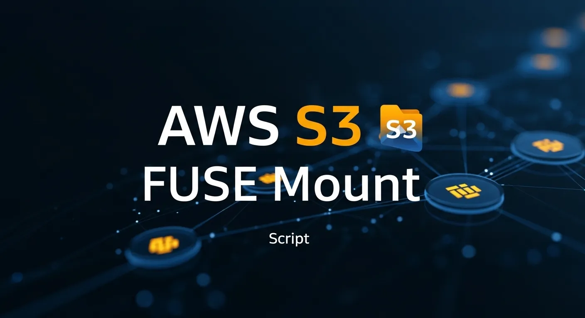

# AWS S3 FUSE Mount 🚀📦

Readme: [EN](README.md)




Este repositório fornece um script automatizado e um guia prático para montar buckets do Amazon S3 como sistemas de arquivos locais no Linux, utilizando o s3fs-fuse. Transforme seu armazenamento em nuvem em um diretório local acessível.

## ✨ Funcionalidades

- **Montagem Automática**: Script para configurar e montar buckets S3 com um único comando.
- **Persistência**: Instruções detalhadas para configurar o arquivo /etc/fstab e garantir que o bucket seja montado automaticamente no boot.
- **Gestão de Permissões**: Configuração segura de credenciais via arquivo .passwd-s3fs.
- **Compatibilidade**: Testado em distribuições baseadas em Debian e Ubuntu.
- **Integração de Backup**: Ideal para integrar o S3 como destino de backups de logs ou dump de bancos de dados.

## 🛠️ Pré-requisitos

- Uma conta ativa na **AWS** com um **bucket S3 criado**.
- Chaves de acesso (**Access Key ID** e **Secret Access Key**) com permissões de **leitura/escrita** no bucket.
- Instalação do pacote `s3fs`.

## 🚀 Instalação

1 **Clone o Repositório**

```bash
git clone https://github.com/percioandrade/amazon-fuse-s3
cd s3bucket
chmod +x s3bucket
```

2 **Instale o s3fs**:

```bash
sudo apt update && sudo apt install s3fs -y
```
3 **Configure suas credenciais**:

```bash
echo ACCESS_KEY_ID:SECRET_ACCESS_KEY > ~/.passwd-s3fs chmod 600 ~/.passwd-s3fs
```

4 **Monte o bucket**:
- Crie o ponto de montagem e execute:

```bash
mkdir /mnt/meu-s3 s3fs nome-do-bucket /mnt/meu-s3 -o passwd_file=~/.passwd-s3fs
```

## 🚀 Como Usar

- Instala o `fuse` e o `s3fs`

```bash
s3bucket -i
```
- Cria e monta um novo bucket no sistema

```bash
s3bucket -e
```

- Remove um backup do sistema

```bash
s3bucket -r
```
- Instala o servidor de FTP

```bash
s3bucket -ftp
```

- Mostra a ajuda do script

```bash
./s3bucket -h
```

# Arquivos de configuração ⚙️
- As credenciais da AWS são armazenadas em `~/.passwd-s3fs`
- Configuração de FTP em `/etc/vsftpd/vsftpd.conf`
- Pontos de montagem configurados em `/etc/fstab`
- Logs de todo o sistema em `/var/log/buckets3.log`
- Logs específicos do usuário em `$USERPATH/$USER/buckets3-$USER.log`
- Arquivo de log mestre em `$USERPATH/buckets3.log`

# Screens


<br />


<br />


## ⚠️ Aviso Legal

> [!WARNING]
> Este software é fornecido "tal como está". Certifique-se sempre de ter permissão explícita antes de executar. O autor não se responsabiliza por qualquer uso indevido, consequências legais ou impacto nos dados causados ​​por esta ferramenta.

## 📚 Detailed Tutorial

Para um guia completo, passo a passo, confira meu artigo completo:

👉 [**Create a Bucket for AWSS3 in your server**](https://perciocastelo.com.br/blog/create-a-bucket-for-aswss3-in-your-server.html)

## Licença 📄

Este projeto está licenciado sob a **GNU General Public License v3.0**. Consulte o arquivo [LICENSE](LICENSE) para mais detalhes.