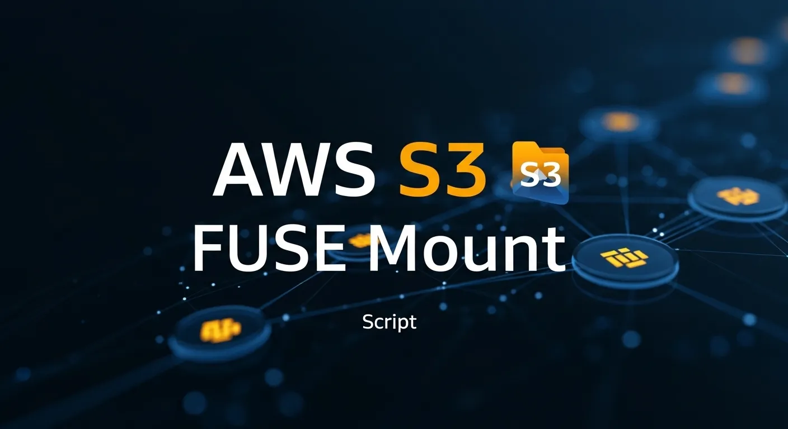

# AWS S3 FUSE Mount 🚀📦

Read me: [Português](README-ptbr.md)

This repository provides an automated script and a practical guide to mount Amazon S3 buckets as local file systems on Linux, using s3fs-fuse. Turn your cloud storage into an accessible local directory.




## ✨ Features

- **Automatic Mounting**: Script to configure and mount S3 buckets with a single command.
- **Persistence**: Detailed instructions to configure the /etc/fstab file and ensure the bucket is mounted automatically at boot.
- **Permission Management**: Secure credential configuration via the .passwd-s3fs file.
- **Compatibility**: Tested on Debian and Ubuntu-based distributions.
- **Backup Integration**: Ideal for integrating S3 as a destination for log backups or database dumps.

## 🛠️ Prerequisites

- An active **AWS** account with an **S3 bucket created**.
- Access keys (**Access Key ID** and **Secret Access Key**) with **read/write** permissions on the bucket.
- Installation of the `s3fs` package.

## 🚀 Installation

1 **Clone the Repository**

```bash
git clone https://github.com/percioandrade/amazon-fuse-s3
cd s3bucket
chmod +x s3bucket
```

2 **Install s3fs**:

```bash
sudo apt update && sudo apt install s3fs -y
```

3 **Configure your credentials**:

```bash
echo ACCESS_KEY_ID:SECRET_ACCESS_KEY > ~/.passwd-s3fs chmod 600 ~/.passwd-s3fs
```

4 **Mount the bucket**:
- Create the mount point and run:

```bash
mkdir /mnt/my-s3 s3fs bucket-name /mnt/my-s3 -o passwd_file=~/.passwd-s3fs
```

## 🚀 How to Use

- Installs `fuse` and `s3fs`

```bash
s3bucket -i
```

- Creates and mounts a new bucket in the system

```bash
s3bucket -e
```

- Removes a system backup

```bash
s3bucket -r
```

- Installs the FTP server

```bash
s3bucket -ftp
```

- Shows script help

```bash
./s3bucket -h
```

# Configuration files ⚙️
- AWS credentials are stored in `~/.passwd-s3fs`
- FTP configuration in `/etc/vsftpd/vsftpd.conf`
- Mount points configured in `/etc/fstab`
- System-wide logs in `/var/log/buckets3.log`
- User-specific logs in `$USERPATH/$USER/buckets3-$USER.log`
- Master log file in `$USERPATH/buckets3.log`

# Screenshots


<br />


<br />


## ⚠️ Legal Notice

> [!WARNING]
> This software is provided "as is". Always make sure to test first in a development environment. The author is not responsible for any misuse, legal consequences, or data impact caused by this tool.

## 📚 Detailed Tutorial

For a complete, step-by-step guide, check out my full article:

👉 [**Create a Bucket for AWSS3 on your server**](https://perciocastelo.com.br/blog/create-a-bucket-for-aswss3-in-your-server.html)

## License 📄

This project is licensed under the **GNU General Public License v3.0**. See the [LICENSE](LICENSE) file for more details.
